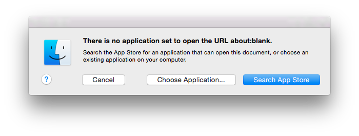

AboutWeb
========

This is a simple app designed to remove this dialog:

That's it. That's all it does.

Usage
-----

1. [Download this repo](https://github.com/szhu/AboutWeb/archive/master.tar.gz)
   and untar, or `git clone https://github.com/szhu/AboutWeb.git`.
2. You may need to manually open the app once to get rid of the Gatekeeper
   warning. You can do this by right-clicking on the app and selecting Open, or
   by running `bin/un-gatekeeper-ify`.
3. That's it! This app will register itself to open `about:` URLs and will
   handle them by doing nothing.

References
----------

- [rsms/fb-mac-messenger#126](https://github.com/rsms/fb-mac-messenger/issues/126)
